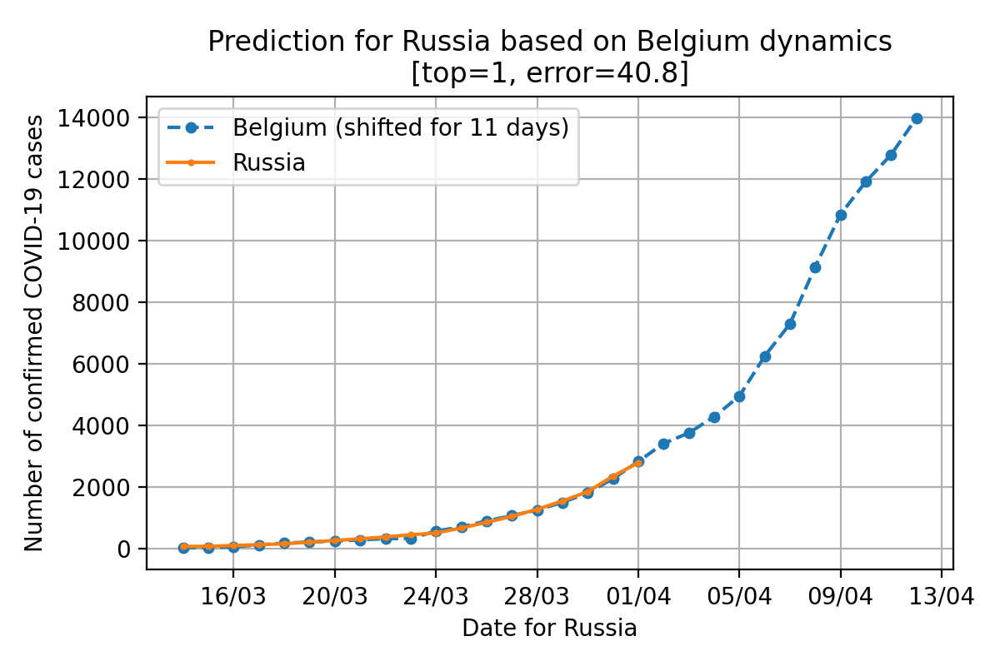

# COVID-19 future prediction
[](https://colab.research.google.com/github/weiji14/deepbedmap/]

*Disclaimer:* all predictions are just predictions and can have nothing in common with reality.

The code in this repository tries to predict the future dynamics of confirmed COVID-19 cases for the selected country by comparing it to all other countries. So it's some kind of 1-nearest-neighbor model.

Used data API: https://github.com/pomber/covid19.

## Example
Top-1 fututre prediction for Russia is Belguim dynamics (02 April 2020):



## Install requirements
```bash
pip install requests numpy matplotlib
```

## Run
All code is written in Jupyter Notebook. Just run `covid19_future_prediction.ipynb` and change `base_location` variable to choose a country you want to generate a prediction for.

The plots will be drawn in the notebook and also saved to `./results` directory.

## Contributors
 - [Karim Iskakov](https://github.com/karfly)

[](https://colab.research.google.com/github/karfly/covid19-future-prediction/blob/master/covid19_future_prediction.ipynb)
